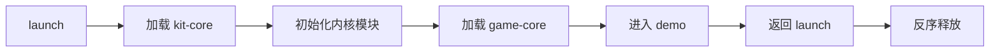

# CocosKit

Cocos Creator 3.8.8 通用游戏开发框架。

## 阶段一：最小闭环

当前已实现：

- `main` 启动场景、Bundle 清单、加载器和启动流水线。
- `kit-core` 模块生命周期、服务、事件、日志、资源和场景模块。
- `game-core` 示例内容 Bundle。
- Bundle 依赖排序、模块正序启动与反序销毁的集成测试。

运行时流程：

使用 Cocos Creator 打开项目后，预览 `assets/main/scenes/launch.scene`。示例场景会显示蓝色背景，并在两秒后自动返回启动场景；时间和 Bundle 名称集中配置在 `assets/main/scripts/Environment.ts`。
