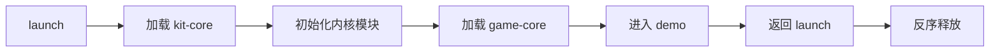

# CocosKit

Cocos Creator 3.8.8 通用游戏开发框架。

## 阶段一：最小闭环

当前已实现：

- `main` 启动场景、Bundle 清单、加载器和启动流水线。
- `kit-core` 模块生命周期、服务、事件、日志、资源和场景模块。
- `game-core` 示例内容 Bundle。
- Bundle 依赖排序、模块正序启动与反序销毁的集成测试。

运行时流程：

使用 Cocos Creator 打开项目后，预览 `assets/main/scenes/launch.scene`。示例场景会显示蓝色背景，并在两秒后自动返回启动场景；时间和 Bundle 名称集中配置在 `assets/main/scripts/Environment.ts`。

## 阶段二：常规游戏能力

当前已接入统一门面：

- `core.ui`：Prefab 路由、七层 UI、返回栈、缓存，以及 Animation 或缩放/透明度 Tween 开关动画策略。
- `core.data`：JSON 配置加载、主键索引和运行时覆盖。
- `core.storage`：环境/账号分区、数据版本和迁移。
- `core.audio`：BGM、音效、音量、静音和资源释放。
- `core.network`：HTTP/JSON、超时、重试及 WebSocket 断线重连。
- `core.platform`：Web Mobile 能力检测与可替换平台适配器。
- `core.lifecycle`：前后台状态，以及场景切换前后通知；BGM 会随前后台自动暂停和恢复。
- `core.i18n`：JSON/内存语言包、语言回退、参数插值、基础复数形式和语言切换通知。

UI 路由支持通过 `registerMany()` 集中注册，并可按层级设置共享动画预设；单个路由只有在需要特殊表现时才覆盖自己的动画策略。

`game-core/scripts/sample/SampleGameFlow.ts` 提供登录、大厅、设置和断线恢复的最小业务串联。真实 UI Prefab、服务器地址和协议字段由具体项目配置接入，不写死在通用模块中。

当前 i18n 首版聚焦文本能力；本地化图片、字体和音频待项目出现真实资源后，再基于资源键扩展，避免提前固定资源组织方式。
