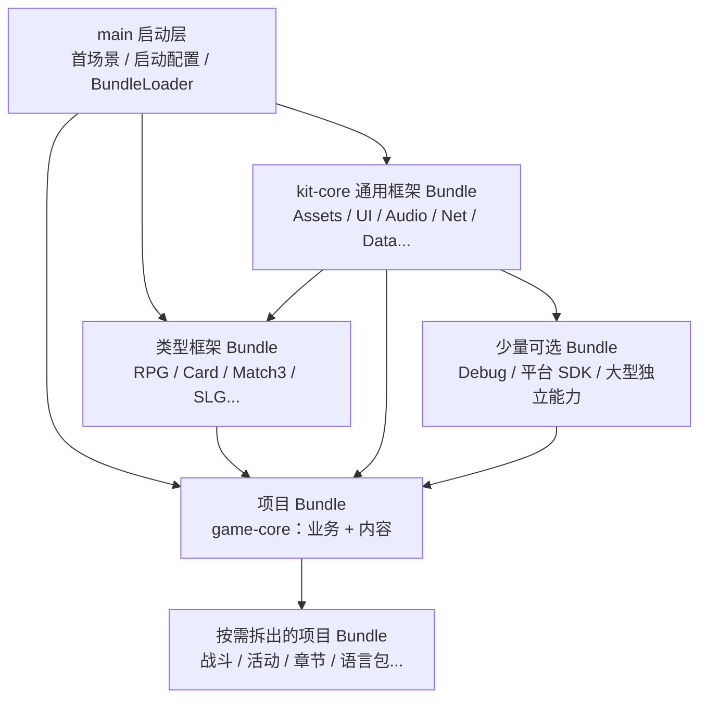
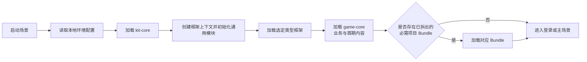
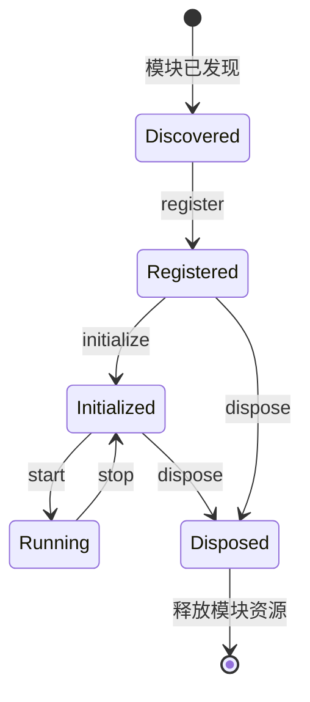

# CocosKit 通用游戏开发框架规划

> 适用版本：Cocos Creator 3.8.8  
> 当前阶段：阶段一实施，已建立最小加载与释放闭环
> 目标：建立一套可复用、可裁剪、可按需加载，并能继续扩展游戏类型框架的开发底座。

## 1. 建设目标

CocosKit 分为三类能力：

1. **启动能力**：负责启动游戏、读取配置、装载 Bundle 和组装模块，保持足够小且始终随首包存在。
2. **通用能力**：与具体玩法无关，可被多数游戏复用，例如资源、界面、音频、网络、存档和本地化。
3. **类型与项目能力**：类型框架封装某一类游戏的共性，项目层只保留当前游戏特有的规则与内容。

核心原则：

- 通用框架不依赖任何具体玩法。
- 类型框架只能依赖通用框架，不能反向依赖。
- 不同类型框架之间相互独立，不形成隐式依赖。
- 项目业务依赖框架提供的接口，通过注册或配置接入，避免修改框架源码。
- 首包只放启动必需内容，其余功能和资源按需加载。
- **代码模块不等于 Asset Bundle**：模块负责划分代码职责，Bundle 负责划分加载、发布和卸载边界。
- 通用能力默认作为 `kit-core` 内部模块组织，只有确有独立加载价值时才拆分 Bundle。
- 项目业务与项目内容初期统一放入 `game-core`，先按目录保持边界；只有出现明确的独立加载、更新、卸载或发布需求时才拆分 Bundle。
- 优先使用简单明确的设计，不为了“以后可能用到”提前堆叠抽象。

## 2. 总体分层



允许的依赖方向为“上层依赖下层”。通用能力先在 `kit-core` 内按目录划分模块，项目业务和内容先在 `game-core` 内按目录划分，不为了代码分类而拆 Bundle。确实需要共享的内容应下沉到更基础的层级，而不是建立交叉引用。

## 3. Bundle 规划

### 3.1 启动层：`main`

`main` 使用 Creator 默认主包，不额外配置成 Asset Bundle。这里只保留首屏运行不可缺少的内容。

| 模块 | 职责 | 说明 |
| --- | --- | --- |
| `AppBootstrap` | 串联整个启动流程 | 项目唯一启动入口 |
| `Environment` | 选择开发、测试、正式环境 | 不在代码中散落地址和开关 |
| `BundleCatalog` | 描述 Bundle 名称、版本、依赖和加载策略 | 作为运行期 Bundle 清单 |
| `BundleLoader` | 加载、查询、卸载 Bundle | 启动层必须具备，不能放进尚未加载的 Bundle |
| `LaunchPipeline` | 按步骤执行初始化任务 | 支持进度、失败重试和超时处理 |
| `LaunchView` | 展示启动画面、进度及错误提示 | 只引用主包资源 |
| `GameLauncher` | 根据配置进入具体游戏入口 | 不直接实现玩法 |

推荐启动顺序：



### 3.2 通用内核：`kit-core`

`kit-core` 是通用框架的唯一基础 Bundle。资源、场景、UI、音频、网络等能力在代码层面保持独立模块，但初期不分别建立 `kit-*` Bundle。这样既能保持职责清晰，也能减少 Bundle 依赖、加载顺序和跨包引用的复杂度。

| 模块 | 职责 | 建议边界 |
| --- | --- | --- |
| `contracts` | 公共接口、类型、错误码和生命周期约定 | 只定义契约，不实现业务 |
| `module` | 模块注册、初始化、停用、销毁及依赖排序 | 统一管理代码模块和 Bundle 入口的生命周期 |
| `service` | 服务注册、查找和替换 | 便于项目替换默认实现和测试 |
| `event` | 进程内事件发布与订阅 | 事件需要明确归属和释放时机 |
| `lifecycle` | 游戏前后台、场景切换、暂停恢复等生命周期分发 | 屏蔽调用方差异 |
| `task` | 串行、并行任务和取消控制 | 主要服务于启动及资源流程 |
| `time` | 定时任务、倒计时、服务器时间校准接口 | 不让业务各自管理计时器 |
| `pool` | 通用对象池与节点池封装 | 避免频繁创建高成本对象 |
| `fsm` | 小型有限状态机 | 用于流程、角色或界面状态 |
| `log` | 分级日志、标签、输出适配 | 正式环境可以裁剪调试日志 |
| `utils` | 纯函数工具 | 仅收纳高复用能力，禁止成为杂物箱 |

`kit-core` 可以包含少量真正通用的默认预制体和配置，但不建议放入大型图片、成批音频、平台 SDK、具体游戏数据及某一种玩法规则。项目内容默认归入 `game-core`；当体积、加载、更新或卸载需求达到 3.4 的判断标准时，再拆为独立项目 Bundle。

### 3.3 `kit-core` 内部功能模块

以下内容都是 `kit-core/scripts` 下的代码模块，不是独立 Asset Bundle。模块之间通过接口协作，并由统一模块入口完成注册和初始化。

#### `assets`：资源管理

- Asset、Prefab、Scene、SpriteFrame 等资源的单个、批量和目录加载接口。
- 远程资源加载，以及资源项或下载字节的标准化进度回调。
- Bundle 内资源路径约定和类型安全校验。
- 引用计数、资源作用域和批量释放。
- 预加载、加载队列、并发数、失败重试和进度汇总。
- 常驻资源与场景资源分离。
- 资源泄漏诊断，仅在开发或调试构建开启。

说明：底层 `BundleLoader` 留在 `main`，`kit-core/assets` 负责 Bundle 已加载后的高级资源管理。这样不会出现“为了加载资源模块，先要使用资源模块”的循环问题。

#### `ui`：界面系统

- UI 层级：场景、全屏页、窗口、弹窗、提示、引导、顶层遮罩。
- 界面打开、关闭、返回栈、互斥和缓存策略。
- View 与 Presenter/ViewModel 的生命周期约定。
- Loading、Toast、确认框等基础组件。
- 刘海屏、安全区、横竖屏和分辨率适配。
- 点击防抖、输入锁和过渡动画。
- UI 资源随界面作用域自动释放。

#### `audio`：音频系统

- 背景音乐、音效、语音分类播放。
- 音量、静音、淡入淡出、优先级和并发限制。
- 音频资源缓存与释放。
- 前后台切换及被系统音频打断后的恢复。
- 音频配置和用户设置持久化接口。

#### `network`：网络系统

- HTTP 与 WebSocket 的统一请求入口。
- 请求序号、超时、重试、取消和并发控制。
- 协议编解码接口，不绑定 JSON、Protobuf 等具体实现。
- 公共请求头、鉴权、心跳、断线与重连。
- 网络状态事件和错误归一化。
- Mock 传输层，便于无服务器阶段联调。

安全相关内容如令牌存储、证书校验和协议加密需按目标平台单独评审，不能只依赖通用封装。

#### `data`：配置与运行数据

- 静态配置表的加载、索引、校验和版本管理。
- DTO 与运行时模型的转换。
- 玩家数据仓库和数据变更通知。
- 配置覆盖机制，方便测试或活动配置替换。
- 开发环境的数据一致性检查。

#### `storage`：本地存储与存档

- 简单键值设置、结构化存档和缓存分区。
- 数据版本、迁移、校验、备份与恢复。
- 序列化和可选加密接口。
- 按账号、角色和环境隔离数据。

#### `i18n`：本地化

- 文本、图片、字体和音频的多语言切换。
- 参数化文案、复数规则和缺失键检查。
- 语言包独立 Bundle 化和按需下载。
- 系统语言识别、用户选择及回退语言。

#### `platform`：平台适配

- 登录、支付、分享、广告、剪贴板、震动和权限等统一接口。
- Web、原生、小游戏等平台分别提供适配器。
- 平台 SDK 回调转换为 Promise 或框架事件。
- 能力检测；业务不得假设所有平台都支持同一功能。

#### `scene`：场景与流程

- 场景切换、预加载、过渡、失败恢复。
- 游戏全局流程状态，例如启动、登录、大厅、对局和结算。
- 切场景前后的模块通知及资源作用域清理。
- 避免业务直接散落调用 `director.loadScene`。

#### `guide`：新手引导

- 引导步骤编排、条件判断、跳过和恢复。
- UI 聚焦、遮罩、点击穿透和世界节点指引。
- 引导进度存档与版本迁移。
- 用配置描述流程，具体业务动作通过适配接口注入。

#### `debug`：开发调试

- 游戏内日志面板、环境切换和调试命令。
- 网络请求查看、配置查询、资源引用统计。
- GM 命令入口、帧率和内存信息展示。
- 调试接口可以位于 `kit-core`，调试面板和专用资源可在确有体积或构建隔离需求时拆为 `kit-debug` Bundle。

#### 后续按需增加

- `analytics`：埋点、崩溃与性能上报的厂商无关接口。
- `notification`：本地通知、红点和消息中心。
- `update`：资源版本检查与热更新，仅在明确目标平台后设计。
- `replay`：操作记录、战斗回放和问题复现。
- `test-support`：自动化测试夹具、Mock 服务和测试场景。

这些模块不建议第一阶段全部实现，应由真实项目需求驱动加入。即使实现，也先作为 `kit-core` 的内部模块；达到独立 Bundle 的判断条件后再拆分。

### 3.4 独立 Bundle 的判断标准

代码目录可以随时细分，但新增 Asset Bundle 应至少满足下面一项明确需求：

| 判断条件 | 典型例子 |
| --- | --- |
| 并非所有游戏或运行流程都需要 | 调试面板、特定平台 SDK、某种附加玩法 |
| 体积明显影响首包 | 大量 UI 皮肤、语音、视频、字体 |
| 需要远程加载或独立更新 | 活动、章节、语言包 |
| 需要在运行期间整体卸载 | 战斗、低频功能、限时活动 |
| 需要按平台或渠道隔离构建 | 广告、支付、厂商 SDK |
| 有独立版本和发布节奏 | 可插拔玩法或大型内容包 |

如果拆分理由只是“让代码目录看起来更整齐”，则不应创建 Bundle，改用 `kit-core/scripts/<模块名>` 即可。是否拆包应由加载和发布需求决定，而不是由文件数量决定。

### 3.5 游戏类型 Bundle

类型框架统一采用 `genre-<类型>` 命名，只包含该类型游戏普遍需要的规则与工具。

| 示例 Bundle | 可包含的模块 | 不应包含 |
| --- | --- | --- |
| `genre-rpg` | 属性系统、Buff、技能、战斗实体、战斗流程、数值公式接口 | 某个项目的英雄、剧情和关卡数值 |
| `genre-card` | 卡牌模型、牌库、手牌、效果结算、回合流程、目标选择 | 项目专属卡牌效果和美术资源 |
| `genre-match3` | 棋盘、格子、消除规则、掉落补位、关卡目标接口 | 特定主题皮肤和关卡数据 |
| `genre-slg` | 地图单元、建造队列、行军、资源产出、战报模型 | 某项目的兵种与联盟规则 |

每个类型框架建议拆为两部分：

- `runtime`：纯规则与运行期组件，可被正式游戏使用。
- `editor`：配置检查、可视化工具或资源生成工具。编辑器扩展应放在项目 `extensions` 目录，不随运行时 Bundle 发布。

当某个类型体量明显增大时，可继续拆分，例如 `genre-rpg-combat`、`genre-rpg-world`。拆分依据是独立加载和发布需求，而不是单纯按文件数量拆包。

### 3.6 项目业务与内容 Bundle

具体游戏接入时，**项目业务与项目内容先统一放入一个 `game-core` Bundle**。登录、主流程、玩法实现、项目 UI、关卡、角色、音频和本地化资源先按目录划分职责，不在项目初期创建多个 Asset Bundle。

推荐的包内组织如下：

```text
game-core/
├─ scripts/                              # 项目规则、业务服务和流程
│  ├─ login/
│  ├─ lobby/
│  ├─ battle/
│  └─ level/
├─ configs/                              # 跨功能使用的项目全局配置
└─ content/                              # 全部项目资源，仅是目录边界
   ├─ shared/                            # 多个功能真正复用的资源
   │  ├─ prefabs/
   │  ├─ textures/
   │  └─ fonts/
   ├─ login/
   │  ├─ scenes/
   │  ├─ prefabs/
   │  └─ textures/
   ├─ lobby/
   │  ├─ scenes/
   │  ├─ prefabs/
   │  └─ audio/
   ├─ battle/
   │  ├─ scenes/
   │  ├─ prefabs/
   │  ├─ effects/
   │  └─ audio/
   ├─ levels/
   │  └─ level-001/
   │     ├─ level.scene
   │     ├─ level.json
   │     └─ textures/
   ├─ characters/
   └─ locales/
```

这里的 `content` 只是 `game-core` 内部目录，不是独立 Bundle。资源采用“功能模块优先、资源类型次级”的组织方式，例如 `content/battle/prefabs`，不再同时设置顶层 `scenes`、`prefabs` 等目录。同一功能的场景、预制体、贴图、音频和特效放在一起，便于按功能查找、加载、释放以及后续整体拆包。

模块目录应对应登录、大厅、战斗、关卡、活动等较稳定的加载或生命周期边界，不为每个小业务概念单独建目录。`shared` 只接收确实被多个模块复用、生命周期长于单个模块且无法明确归属的资源，禁止成为杂物目录。

TypeScript 代码统一放在 `scripts/<模块>`，不放入 `content`。仅属于某个内容单元的数据跟随该内容存放，例如 `content/levels/level-001/level.json`；跨多个功能使用的项目全局配置放在顶层 `configs`。业务代码可以直接解释和使用同包内容，但仍应通过资源管理模块统一加载和释放，避免在业务代码中散落资源路径。

只有满足 3.4 的判断标准，并且收益大于跨包依赖与发布成本时，才从 `game-core` 拆出 Bundle。拆分后可按实际职责命名：

| 候选 Bundle | 何时才拆分 |
| --- | --- |
| `game-ui` | 界面资源体积较大，且需要独立加载或卸载 |
| `game-battle` | 战斗代码与资源可以在进出战斗时整体加载和释放 |
| `game-feature-<名称>` | 功能需要独立上线、下线或版本发布，例如公会、活动 |
| `content-level-<章节>` | 章节需要远程下载、分批发布或通关后释放 |
| `content-character-<分组>` | 角色资源体积较大，且可按分组下载或卸载 |
| `content-locale-<语言>` | 语言资源需要按用户选择下载和切换 |

拆分不是单向决定：如果拆出的 Bundle 没有形成独立加载、更新、卸载或发布边界，应合回 `game-core`。对于已经拆出的纯内容 Bundle，它只提供资产和配置，不直接持有业务单例；`game-core` 负责解释和使用内容。

## 4. 推荐目录结构

```text
CocosKit/
├─ assets/
│  ├─ main/                              # 默认主包：启动所需最小内容
│  │  ├─ scenes/
│  │  │  └─ launch.scene
│  │  ├─ scripts/
│  │  │  ├─ AppBootstrap.ts
│  │  │  ├─ BundleCatalog.ts
│  │  │  ├─ BundleLoader.ts
│  │  │  └─ LaunchPipeline.ts
│  │  ├─ prefabs/
│  │  │  └─ LaunchView.prefab
│  │  └─ resources/                      # 仅放启动画面必需资源
│  │
│  ├─ bundles/                           # 下列一级目录分别配置为 Asset Bundle
│  │  ├─ kit-core/
│  │  │  ├─ scripts/
│  │  │  │  ├─ contracts/
│  │  │  │  ├─ module/
│  │  │  │  ├─ service/
│  │  │  │  ├─ event/
│  │  │  │  ├─ lifecycle/
│  │  │  │  ├─ task/
│  │  │  │  ├─ assets/
│  │  │  │  ├─ scene/
│  │  │  │  ├─ ui/
│  │  │  │  ├─ audio/
│  │  │  │  ├─ network/
│  │  │  │  ├─ data/
│  │  │  │  ├─ storage/
│  │  │  │  ├─ i18n/
│  │  │  │  ├─ platform/
│  │  │  │  ├─ guide/
│  │  │  │  ├─ debug/
│  │  │  │  ├─ time/
│  │  │  │  ├─ pool/
│  │  │  │  ├─ fsm/
│  │  │  │  ├─ log/
│  │  │  │  ├─ utils/
│  │  │  │  └─ KitCoreEntry.ts            # Bundle 统一入口
│  │  │  ├─ prefabs/                      # 少量真正通用的基础预制体
│  │  │  └─ configs/
│  │  │
│  │  ├─ kit-debug/                       # 可选：需要与正式构建隔离时再创建
│  │  │
│  │  ├─ genre-rpg/                      # 示例：按需保留一种或多种类型框架
│  │  ├─ genre-card/
│  │  ├─ genre-match3/
│  │  ├─ genre-slg/
│  │  │
│  │  ├─ game-core/                      # 默认唯一项目 Bundle：业务与内容
│  │  │  ├─ scripts/                     # 按功能模块组织代码
│  │  │  │  ├─ login/
│  │  │  │  ├─ lobby/
│  │  │  │  ├─ battle/
│  │  │  │  └─ level/
│  │  │  ├─ configs/                     # 跨功能使用的项目全局配置
│  │  │  └─ content/
│  │  │     ├─ shared/
│  │  │     │  ├─ prefabs/
│  │  │     │  ├─ textures/
│  │  │     │  └─ fonts/
│  │  │     ├─ login/
│  │  │     │  ├─ scenes/
│  │  │     │  ├─ prefabs/
│  │  │     │  └─ textures/
│  │  │     ├─ lobby/
│  │  │     │  ├─ scenes/
│  │  │     │  ├─ prefabs/
│  │  │     │  └─ audio/
│  │  │     ├─ battle/
│  │  │     │  ├─ scenes/
│  │  │     │  ├─ prefabs/
│  │  │     │  ├─ effects/
│  │  │     │  └─ audio/
│  │  │     ├─ levels/
│  │  │     ├─ characters/
│  │  │     └─ locales/
│  │  │
│  │  ├─ game-battle/                    # 仅在需要独立加载时创建
│  │  ├─ game-feature-example/           # 仅在需要独立发布或卸载时创建
│  │  ├─ content-level-example/           # 仅在需要远程下载或分批发布时创建
│  │  └─ content-locale-zh-cn/            # 仅在需要按语言下载时创建
│  │
│  └─ shared-editor/                     # 只供编辑器识别、不进入运行时依赖的资产
│
├─ extensions/                           # Creator 编辑器扩展
│  ├─ cocoskit-config-tools/
│  └─ cocoskit-build-tools/
│
├─ docs/
│  ├─ framework-architecture-plan.md
│  ├─ bundle-rules.md                    # 后续：Bundle 配置和依赖表
│  ├─ module-lifecycle.md                # 后续：模块生命周期协议
│  └─ conventions.md                     # 后续：命名、事件、日志、错误码约定
│
├─ tests/                                # 不导入正式 Bundle 的测试代码与数据
│  ├─ unit/
│  ├─ integration/
│  └─ fixtures/
│
├─ tools/                                # 构建、检查、资源审计等脚本
├─ profiles/                             # Creator 生成/维护
├─ settings/                             # Creator 项目设置
├─ package.json
└─ tsconfig.json
```

上面的 `genre-*`、`game-battle`、`game-feature-*` 和 `content-*` 目录是候选清单，不需要立即全部创建。通用能力默认全部收纳在 `kit-core` 中；项目业务和内容默认全部收纳在 `game-core` 中，分别通过包内目录保持边界。第一阶段只创建真正准备实现的目录，避免空目录和无效 Bundle 增加维护成本。

### 4.1 单个 Bundle 的内部模板

Bundle 的代码与 `kit-core` 使用相同的组织方式：`scripts` 下直接按功能模块命名，不采用 `domain`、`application`、`infrastructure`、`presentation` 这类技术分层目录。`game-core` 的资源则遵循 3.6 的约定，统一放在 `content` 下，并按“功能模块优先、资源类型次级”组织。

以 RPG 类型框架为例：

```text
genre-rpg/
├─ scripts/
│  ├─ attribute/                         # 属性及数值计算
│  ├─ entity/                            # 战斗实体和角色基础能力
│  ├─ skill/                             # 技能定义、释放和效果
│  ├─ buff/                              # Buff 生命周期和叠加规则
│  ├─ combat/                            # 战斗过程与结算
│  ├─ flow/                              # 类型框架的流程控制
│  ├─ common/                            # 仅存放本 Bundle 内真正共享的内容
│  └─ GenreRpgEntry.ts                   # Bundle 统一入口
├─ prefabs/
├─ scenes/
├─ animations/
├─ materials/
├─ textures/
├─ audio/
├─ configs/
└─ module.json                           # 模块元数据，格式在实现阶段确定
```

其他 Bundle 也按实际功能命名，例如卡牌框架可以使用 `deck`、`hand`、`effect`、`turn`，项目业务可以使用 `login`、`lobby`、`battle`、`settings`。目录名应让人一眼看出功能，不应只是描述代码属于哪一层。

当单个功能目录变得复杂时，可以在其内部继续按更细功能拆分，但仍优先使用业务含义明确的名称。并非每个 Bundle 都要拥有所有资源目录；纯逻辑类型框架只保留 `scripts`，不要为统一外观创建大量空文件夹。

## 5. 模块生命周期设计

`kit-core` 内部功能模块、类型框架和项目功能建议遵循相同生命周期。生命周期属于“模块”，不要求每个模块对应一个 Bundle：



| 阶段 | 应做的事情 | 不应做的事情 |
| --- | --- | --- |
| `register` | 注册接口、服务工厂和静态描述 | 发网络请求、打开 UI |
| `initialize` | 读取配置、创建内部对象、订阅全局事件 | 进入具体业务流程 |
| `start` | 启动计时、网络监听或功能入口 | 重复注册服务 |
| `stop` | 停止活动、取消请求、移除临时监听 | 销毁仍可能复用的数据 |
| `dispose` | 释放资源、事件和服务 | 留下跨 Bundle 的悬挂引用 |

模块管理器应检查依赖、避免重复初始化，并在停止游戏或卸载所属 Bundle 时按依赖的相反顺序销毁。

## 6. Bundle 依赖与加载规则

### 6.1 依赖规则

1. 每个独立 Bundle 必须声明直接依赖，加载器先完成依赖再启动当前模块。
2. 禁止 Bundle 循环依赖；`kit-core` 内部模块的循环依赖同样需要消除。
3. `kit-core` 不引用类型、项目或已拆分内容 Bundle 的资源和脚本。
4. 类型框架只依赖 `kit-core`，以及极少数经过确认的可选基础 Bundle。
5. 项目 Bundle 可以依赖一种类型框架，但类型框架不能引用项目内容。
6. 从 `game-core` 拆出的纯内容 Bundle 原则上不依赖业务 Bundle；多个已拆分 Bundle 共享的资产，应根据实际生命周期保留在 `game-core`，或在确有独立边界时再提取公共内容 Bundle。
7. 跨 Bundle 通信优先使用 `contracts` 中的接口或事件，不直接查找对方内部组件。
8. `kit-core` 内部模块使用普通 TypeScript 依赖，不为它们维护额外的 Bundle 加载顺序。

### 6.2 加载策略

| 策略 | 适用内容 | 示例 |
| --- | --- | --- |
| `startup` | 启动后立即需要 | `kit-core`、`game-core` |
| `before-scene` | 进入某场景前加载 | 大厅资源、战斗资源 |
| `on-demand` | 首次使用时加载 | 支付 SDK、分享 SDK、特定玩法 |
| `preload-idle` | 空闲时预加载 | 下一章节或下一局资源 |
| `remote` | 从远端下载并缓存 | 活动、语言和大体积内容 |
| `dev-only` | 仅开发环境 | `kit-debug` |

### 6.3 卸载策略

- 常驻：`kit-core`、当前项目主流程和高频公共资源。
- 场景级：离开场景后统一释放，适合大厅或战斗资源。
- 功能级：关闭低频功能且引用归零后释放。
- 内容级：章节、活动或语言切换后释放旧内容。

卸载 Bundle 前必须先停止模块、清理事件和计时器、关闭相关 UI、释放由该 Bundle 创建的资源引用，最后再卸载 Bundle。仅调用 Bundle 的释放接口并不能代替业务引用清理。

## 7. 资源组织规范

- Bundle 名称统一使用小写短横线，例如 `kit-core`、`genre-card`、`content-level-01`。
- 资源路径使用小写目录，文件名采用团队统一规则；不要依赖文件名大小写差异。
- 跨 Bundle 公共资源必须明确归属，禁止随手复制到多个 Bundle。
- 大图、音频、视频、字体和骨骼动画先放入 `game-core/content`；当它们明显影响首包、需要远程下载或可以整体卸载时，再拆入独立内容 Bundle。
- `game-core/content` 按功能模块划分一级目录，再在模块内部使用 `scenes`、`prefabs`、`textures`、`audio` 等资源类型目录；不在 `game-core` 顶层重复建立同名资源目录。
- `content/shared` 只存放被多个功能复用且无法明确归属的资源，能归属于具体功能的资源不得提前放入 `shared`。
- 动态加载资源使用稳定的逻辑路径或资源键，不在业务中散落字符串路径。
- Prefab 只引用当前 Bundle 或已声明依赖 Bundle 中的资源。
- 主包资源不得反向引用可选 Bundle，否则会破坏按需加载边界。
- `resources` 目录仅在确实需要路径式动态加载时使用，不作为所有资产的默认容器。
- 为远程 Bundle 记录版本、哈希、大小和兼容的客户端版本，失败时提供回退或明确提示。

## 8. 配置规划

建议把“构建期配置”和“运行期配置”分开：

```text
configs/
├─ build/                                # 渠道、平台、调试能力等构建期选项
├─ environments/                         # dev / test / staging / production
├─ bundles/                              # Bundle 清单、依赖、版本、加载策略
├─ features/                             # 功能开关与灰度配置
└─ gameplay/                             # 项目或类型框架的数据配置
```

配置至少需要覆盖：

- 环境名、服务器地址和日志级别。
- 启用的通用模块与类型框架。
- Bundle 本地/远程地址、版本、依赖、加载策略和是否常驻。
- 平台能力及渠道差异。
- 功能开关和默认值。

敏感密钥不能直接写入客户端配置或仓库；客户端内的任何“加密密钥”都不能视作真正保密。

## 9. 建议的公共约定

后续编码前先确定以下约定，防止各模块形成不同风格：

- 模块入口、生命周期和依赖声明格式。
- 服务注册、获取、替换及作用域。
- 事件命名、事件载荷和取消订阅方式。
- 异步任务取消、超时和错误传递方式。
- 错误码分段和用户提示映射。
- 日志标签、级别及隐私字段脱敏。
- 资源加载句柄、引用计数和释放责任。
- UI 层级、返回行为和打开参数。
- 网络协议版本与数据模型转换边界。
- 配置表主键、空值、枚举和版本迁移规则。

## 10. 测试与质量保障

| 层级 | 重点 |
| --- | --- |
| 单元测试 | 状态机、任务流程、数值公式、配置解析等纯逻辑 |
| 集成测试 | Bundle 依赖排序、模块生命周期、资源释放、网络重连 |
| 场景测试 | 启动、登录、切场景、进出战斗、前后台切换 |
| 构建检查 | 资源重复、循环依赖、Bundle 体积、远程地址、调试代码泄漏 |
| 长时间测试 | 内存增长、事件残留、计时器残留和重复进入场景 |

建议在构建流程加入自动检查：

- Bundle 名称及目录规范。
- 重复 UUID、丢失资源和非法跨包引用。
- Bundle 依赖环。
- 单包体积和首包体积阈值。
- 正式构建误包含 `kit-debug`、测试场景或 Mock 数据。

## 11. 分阶段实施建议

### 阶段一：形成最小闭环

只实现能验证架构的必要模块：

1. 整理 `main` 启动场景和启动流程。
2. 创建 `kit-core`，实现模块生命周期、服务、事件和日志等基础模块。
3. 在 `kit-core` 内实现 `assets` 模块，打通 Bundle 与资源的加载、引用和释放。
4. 在 `kit-core` 内实现 `scene` 模块，完成启动场景到示例场景的切换。
5. 建立 Bundle 依赖清单和最小集成测试。

验收标准：可以由主包加载一个独立 Bundle，完成模块初始化、进入场景、退出场景并正确释放。

### 阶段二：满足常规游戏开发

按真实项目优先级实现：

1. `kit-core/ui`
2. `kit-core/data`
3. `kit-core/storage`
4. `kit-core/audio`
5. `kit-core/network`
6. `kit-core/platform`

验收标准：可以完成登录、大厅、设置、基础数据读取和网络断线恢复的样板流程。

### 阶段三：验证类型框架

选择近期最可能开发的一种游戏类型，只实现一个 `genre-*` Bundle：

1. 提取该类型最稳定的领域模型和流程。
2. 用一个极小的 Demo 项目接入。
3. 记录项目层不得不覆盖或绕开的点。
4. 根据验证结果调整通用接口，再冻结第一版契约。

不要同时开发多个类型框架；先用一个真实样例验证通用层是否足够干净。

### 阶段四：工程化与发布

- 配置检查、资源审计和构建扩展。
- 远程 Bundle、版本兼容和更新策略。
- 性能、内存和崩溃监控。
- 模块模板、示例工程和开发文档。

## 12. 首批建议创建的实际目录

为避免一开始铺得过大，第一轮只建议创建：

```text
assets/
├─ main/
│  ├─ scenes/
│  │  └─ launch.scene
│  └─ scripts/
└─ bundles/
   ├─ kit-core/
   │  └─ scripts/
   │     ├─ assets/
   │     ├─ scene/
   │     ├─ module/
   │     ├─ service/
   │     ├─ event/
   │     └─ log/
   └─ game-core/                         # 仅放阶段一闭环所需的最小示例
      └─ content/
         └─ demo/
            └─ scenes/
               └─ demo.scene

docs/
tests/
└─ integration/
```

待最小闭环通过后，再在 `kit-core/scripts` 中逐个增加 `ui`、`data`、`storage` 等模块。只有模块出现独立下载、更新、卸载或平台隔离需求时，才从 `kit-core` 拆成单独 Bundle。游戏类型未确定前，仅保留本规划中的命名和边界，不创建空的 `genre-*` 目录。

## 13. 后续阶段待确认事项

以下信息不影响阶段一最小闭环，但进入对应功能实现前需要明确：

1. 首个目标平台：Web、Android/iOS、微信小游戏或多平台。
2. 是否需要远程 Bundle，以及是否需要原生热更新。
3. 首个准备验证的游戏类型。
4. 网络协议：HTTP、WebSocket，以及 JSON 或 Protobuf 等编码方式。
5. UI 开发方式：纯 Creator Prefab、MVVM/MVP 倾向和是否使用现有 UI 库。
6. 配置表来源：Excel、JSON、自研后台或其他工具。
7. 是否要求支持多语言、支付、广告和数据上报。
8. 自动化测试与持续集成将运行在哪个平台。

这些问题不影响当前目录规划，但会决定第二阶段模块的实现顺序和接口形态。

## 14. 暂不建议现在处理的内容

- 未确定目标平台前实现完整热更新系统。
- 为所有可能的游戏类型提前建立基类体系。
- 自研复杂的依赖注入容器、响应式框架或脚本虚拟机。
- 把所有管理器塞入一个全局单例。
- 仅为了目录对称而拆出大量小 Bundle。
- 在没有性能数据前进行底层微优化。

先让“加载—初始化—运行—退出—释放”的闭环可靠，再逐步增加能力，是这套框架最重要的落地顺序。
